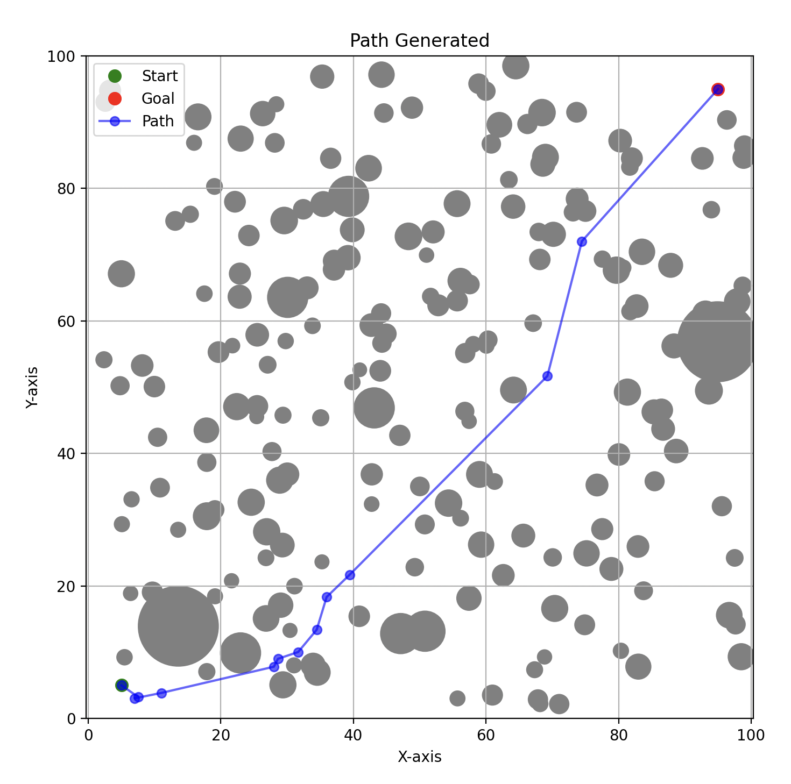

# A Genetic Algorithm Approach to Path Planning in Cluttered 2D Environments

Developed a **continuous-space Genetic Algorithm (GA)** solution for finding collision-free paths in highly cluttered environments while minimizing path length.

For an in-depth explanation of the algorithm and its implementation, refer to the paper titled *"A Genetic Algorithm Approach to Path Planning in Cluttered 2D Environments"* available in this repository. An example path found is shown below: 

This project was completed as a final research project for CS 686: Introduction to Artificial Intelligence at the University of Waterloo.
